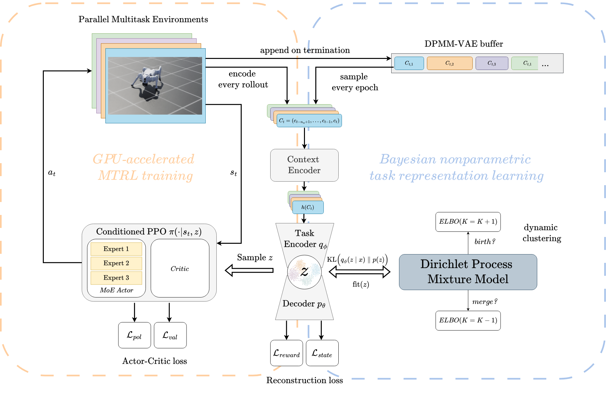

## Multitask Reinforcement Learning of Quadrupeds based on Mixtures of Experts and Bayesian Nonparametric Representations



## Commands


### Run the Multitask Environment

Recommended to use 2048 parallel envs and 2-5K timesteps. Some tasks may converge before 2K timesteps.


Run MT4-Env with PPO via 

```
python scripts/moe_quadruped/train_multitask_ppo.py --task=Isaac-MT-Unitree-Go2-v0 --num_envs=2048 --max_iterations=5000  --run_name=run_multitask_ppo_final_52 --headless --seed 52
```
Run MT4-Env with MoE-PPO architecture via:

```
python scripts\moe_quadruped\train_multitask_moe.py --task=Isaac-MT-Unitree-Go2-v0 --num_envs=2048 --max_iterations=5000  --run_name=run_multitask_final_moe_52  --seed 52 --append_task_id --headless
```


Run MT4-Env with DPMM-VAE PPO via 


```
python scripts/moe_quadruped/train_multitask_dpmm_bnpy_ppo.py --task=Isaac-MT-Unitree-Go2-v0 --num_envs=512 --max_iterations=5000  --run_name=run_multitask_final_dpmm_vae_ppo_449  --seed 449 --append_task_id --headless 
```


### Single task environments

Run singe task training using the train_single_ppo or train_single_moe scripts with the commands as follows

Run Flat Velocity Tracking Task training:

```
python scripts/moe_quadruped/train_single.py --task=Isaac-Velocity-Flat-Unitree-Go2-MoE-v0  --num_envs=4096  --max_iterations=2000 --experiment_name=flat_go2_single --run_name=run_flatveltracking --headless
```

Run Handstand Task training:

```
python scripts/moe_quadruped/train_single_ppo.py --task=Isaac-Velocity-Flat-HandStand-Unitree-Go2-v0 --num_envs=2048 --max_iterations=1500 --experiment_name=handstand_go2_st --run_name=run_handstand --headless 
```

Run Legstand Task training:

```
python scripts/moe_quadruped/train_single_ppo.py --task=Isaac-Velocity-LegStand-Unitree-Go2-MoE-v0 --num_envs=2048 --max_iterations=1500 --experiment_name=legstand_go2_st --run_name=run_legstand --headless
```


Run Crawl Task:

```
python scripts/moe_quadruped/train_single_ppo.py --task=Isaac-Velocity-Lowcrawl-Unitree-Go2-MoE-v0 --num_envs=2048 --max_iterations=1500 --experiment_name=lowcrawl_go2_st --run_name=run_lowcrawl --headless
```


## Multitask Environment

Code based on original author of MT-IsaacLab https://github.com/meenalparakh/MT-IsaacLab

### Add new tasks:

1. Create singletask EnvCfg class in `moe_quadruped_isaaclab/source/isaaclab_tasks/isaaclab_tasks/manager_based/locomotion/velocity/config/go2_moe/`

2. If everything works fine in singletask, add your EnvCfg class to `source/isaaclab_tasks/isaaclab_tasks/manager_based/locomotion_multitask/velocity/config/go2_mt/`

3. Your EnvCfg added in `go2_mt` must subclass a MT-Env, e.g. `go2_mt.flat_env_cfg.UnitreeGo2FlatEnvCfg` class. RewardsCfg can still be imported from your single task, no need to write again.

4. Add your EnvCfg task as an attribute to `go2_mt/mt4_env_cfg.py` as `myEnvTask: TaskConfigs = UnitreeGo2MyEnvCfg()`


## Folder structure

### Tasks

Single tasks code in 

```
source\isaaclab_tasks\isaaclab_tasks\manager_based\locomotion\velocity\config\go2_moe\
```

Multitask code in

```
source\isaaclab_tasks\isaaclab_tasks\manager_based\locomotion_multitask\velocity\config\go2_mt\
```

`mt4_env_cfg.py` implements the joint multitask environment.


### Scripts

All our training scripts `train_ ... .py` are in  

```
scripts\moe_quadruped\
```


Custom RSL RL code for `MoE Actor`, `DPMM-VAE` in

```
source\isaaclab_rl\isaaclab_rl\rsl_rl\
```

and 


```
source\isaaclab_rl\isaaclab_rl\rsl_rl\DPMM\
```


For DPMM-VAE Trainer code located in

```
source\isaaclab_rl\isaaclab_rl\rsl_rl\DPMM\MELTS\tigr\trainer\dpmm_trainer.py
```

## MT4 was created by:


1. Create in source/isaaclab/envs/ two files, `manager_based_mt_rl_env(_cfg).py`, export their classes in `__init__.py`

2. Create folder in source/isaaclab_tasks/isaaclab_tasks/manager_based/locomotion_multitask/velocity, with similar structure to how the normal locomotion/velocity folder is.

3. In the normal velocity/velocity_env_cfg.py, we have MySceneCfg and LocomotionVelocityRoughEnvCfg, here we change both to fit Multitask setting: MySceneCfg should differntiate world- and task specific scene elements through self.world_ prefix. LocomotionVelocityRoughEnvCfg should have no __post_init__(self) method and subclass from TaskConfigs.

4. In velocity/config/ dir, create the multitask env go2_mt. Here we need to rewrite the original go2 configs rough_env_cfg.py, flat_env_cfg.py, ... etc. to match the multitask configs:

- import LocomotionVelocityRoughEnvCfg from isaaclab_tasks.manager_based.locomotion_multitask instead from locomotion.velocity

- subclass it to create UnitreeGo2RoughEnvCfg

- remove super.__init__(), and just write everything inside __post_init__(self)

5. Write the actual Multitask Environment: create a file, mt_env_cfg.py, in which a MTLocomotion class subclasses ManagerBasedMTRL. 

- Put all tasks coded according to step 4. as attributes. 

- Write a function __post_init__(self) in which all setups of __post__init() of LocomotionVelocityRoughEnvCfg should be done.